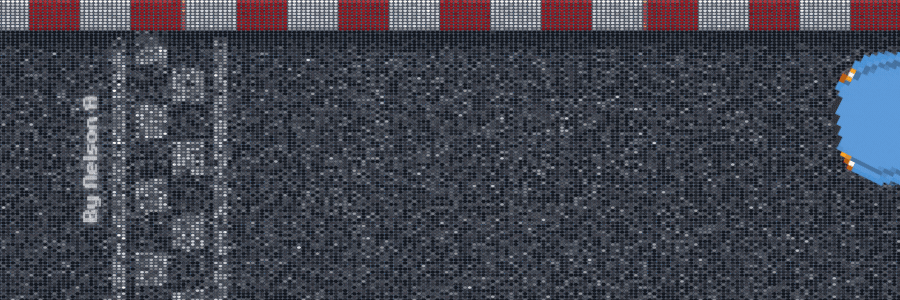

--------

<!--  GitHub Stats --->

<!-- Contact info -->

> **If you're interested in my work or you want to explore some projects with me, don't hesitate to reach me, i would love to!!!💜**

📫 **How to reach me:**

